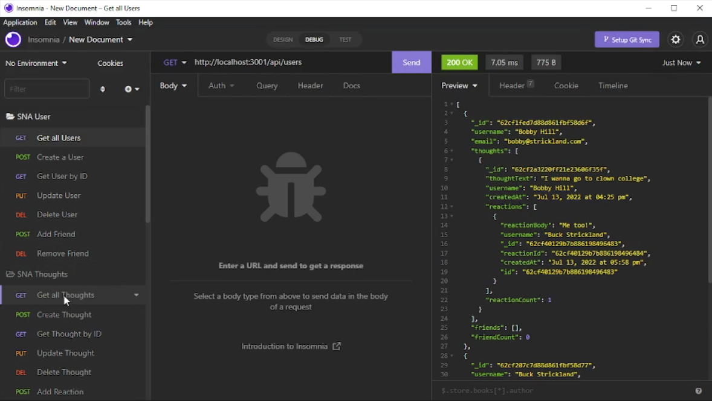

# Social Network API

  

  ## Description

  This is Social Network API backend using MongoDB! Allows for getting, creating, updating, and deleting data within the database.

  ## Table Of Contents

  - [Screenshots](#screenshots)
  - [Installation](#installation)
  - [Usage](#usage)
  - [License](#license)
  - [Guidelines](#guidelines)
  - [Questions](#questions)
  - [Video](#video)

  ## Screenshots

  ## Installation

1) Type in npm i to install packages
2) Type in npm start
3) You are now free to use Insomnia to access the database

  ## Usage

  Use Insomnia to get, post, put, and delete information within the database.
  Database is not seeded before hand, so you will need to use post requests to populate the database.
  
## License
    This work is licensed under Creative Commons Attribution 3.0 Unported License.
    https://creativecommons.org/terms#8

  ## Guidelines

  You are open to do with this code as you wish

  ## Questions

  This repo was created by https://github.com/BenBasic
  To contact me, please send an email to Benjamin@TreneonGames.com

  ## Video
https://youtu.be/bd3pFJSZYmM